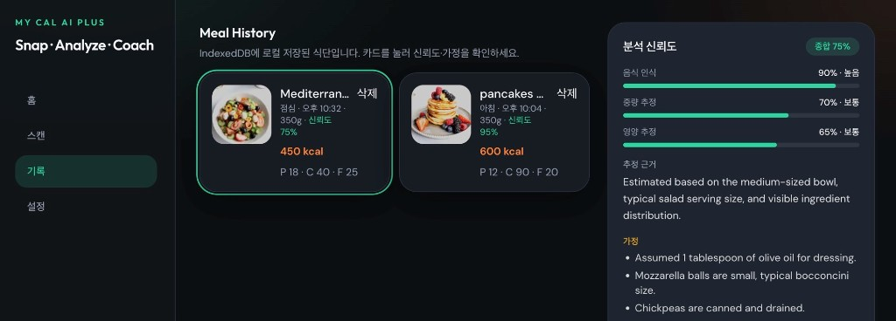

# My Cal AI Plus



> Snap · Analyze · Coach · Improve

OpenAI Vision 기반 AI Native Fitness Coach — Sprint 1 MVP (+ Vision 심화/다크 UI).

- GitHub: https://github.com/junsang-dong/goorm-260715-my-calai-plus-cnn  
- Production: https://goorm-260715-my-calai-plus-cnn.vercel.app  
- 스펙: [doc/SPEC_My_CalAI_Plus_CNN_by_Jun.md](doc/SPEC_My_CalAI_Plus_CNN_by_Jun.md)

---

## 스택

- React 19 + Vite + TypeScript + React Router
- Tailwind CSS 4
- Zustand + IndexedDB (`idb`)
- OpenAI Vision (`gpt-4o` 기본, `OPENAI_VISION_MODEL`로 전환 가능)
- 로컬 API: `scripts/dev-api.mjs` (포트 3000)
- 배포 API: Vercel Serverless `api/vision.js`

---

## 이번 작업 주요 내용

### 1) Vision 분석 고도화

- **스키마 확장**: `ingredients[]`, `portionBasis`, `assumptions`, `uncertaintyNotes`, 필드별 confidence  
  (`identificationConfidence`, `portionConfidence`, `nutritionConfidence`, `overallConfidence`)
- **프롬프트 강화**: 추정 근거·가정·불확실성을 필수 출력, 과도한 고신뢰도 억제 규칙 포함
- **2-pass 분석** (`lib/visionAnalyze.cjs`)
  1. Pass 1 — 음식/재료 식별
  2. Pass 2 — 중량·영양·신뢰도·가정 추정
- **Responses API 우선 + Chat Completions 폴백** (로컬/배포 공통 로직)

### 2) UI / UX

- Cal AI 스타일 **다크 테마** (사이드바, 원형 칼로리 링, 매크로 카드, 재료 태그)
- 스캔 결과·기록 화면에 **신뢰도 %** 및 **가정/주의** 패널 (`ConfidencePanel`)
- **반응형**
  - 모바일: 하단 탭 네비
  - 태블릿: 2열 기록 카드
  - 데스크톱: 좌측 사이드바 + 기록/신뢰도 분할 레이아웃

### 3) CNN 전처리

- 리사이즈 → 대비 향상 → Sobel 엣지 강조 → 약한 노이즈 감소 후 Vision 입력

### 4) 데이터

- IndexedDB 로컬 식사 기록 (서버 DB 없음)
- 구버전 기록도 `normalizeMealRecord`로 안전하게 마이그레이션 표시

---

## 오류 수정 사항

| 이슈 | 원인 | 조치 |
|------|------|------|
| 로컬 `vercel dev` + TS API 크래시 | 루트 `"type": "module"` + TS `rootDir`/함수 부트 오류 (`startsWith`, `TS5011`) | 로컬은 `npm run dev:api`(Node HTTP)로 전환, 배포용은 `api/vision.js`(CJS) |
| Vite 기본 포트/프록시 | API와 프론트 포트 혼선 | Vite **5171** + `/api` → `127.0.0.1:3000` 프록시 |
| OpenAI SDK import 불안정 | serverless에서 SDK 로딩 이슈 | `fetch` 기반 Responses/Chat Completions 호출로 통일 |
| ESM `createRequire` import 오류 | `node:url`에서 import | `node:module`의 `createRequire` 사용 |
| 기록 삭제 클릭 시 카드 선택 간섭 | 이벤트 버블링 | `MealCard` 삭제 버튼 `stopPropagation` |
| TypeScript 6 `baseUrl` deprecation | `tsc -b` 실패 | `ignoreDeprecations: "6.0"` |
| `.env` 시크릿 노출 위험 | — | `.gitignore`에 `.env`, `.vercel` 등록 (커밋 제외) |

---

## 로컬 실행

```bash
npm install
cp .env.example .env   # OPENAI_API_KEY 설정
```

```bash
# 터미널 1 — Vision API (포트 3000)
npm run dev:api

# 터미널 2 — Vite UI (포트 5171)
npm run dev
```

브라우저: http://localhost:5171

### 환경 변수

| 변수 | 위치 | 설명 |
|------|------|------|
| `OPENAI_API_KEY` | 서버 전용 (`.env` / Vercel) | **절대** `VITE_` 접두사로 노출하지 마세요 |
| `OPENAI_VISION_MODEL` | 선택 | 기본 `gpt-4o`. Vision 지원 모델로 교체 가능 |

---

## Vercel 배포

```bash
npx vercel env add OPENAI_API_KEY
npx vercel --prod
```

또는 [Environment Variables](https://vercel.com/jay-nextplatform/goorm-260715-my-calai-plus-cnn/settings/environment-variables)에서 키 등록 후 Redeploy.

---

## 주요 경로

```
api/vision.js              # Vercel serverless 엔트리
lib/visionAnalyze.cjs      # 2-pass Vision 공유 로직
scripts/dev-api.mjs        # 로컬 API 서버
src/pages/                 # Dashboard / Scan / History / Settings
src/components/            # AppShell, ConfidencePanel, MealCard…
src/utils/preprocess.ts    # CNN 스타일 전처리
doc/SPEC_*.md              # 기술명세서
```
